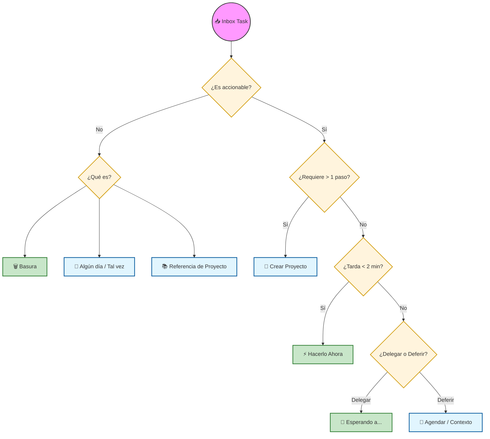
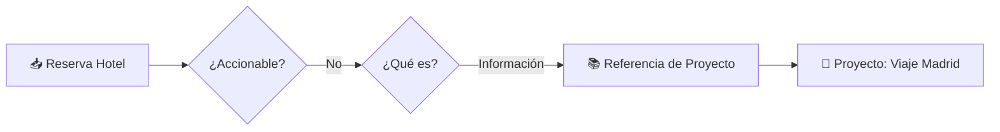
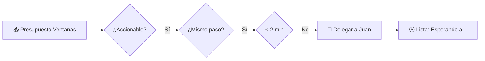
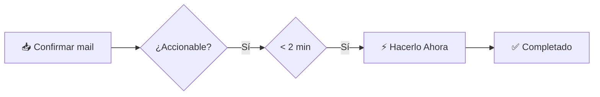

# 📖 Guía de Uso: GTD Master

Bienvenido a **GTD Master**. Esta aplicación no es solo una lista de tareas; es un sistema completo basado en la metodología **Getting Things Done (GTD)** de David Allen. Esta guía te ayudará a entender los conceptos y a sacar el máximo provecho de la app.

---

## 🧠 Conceptos Core de GTD

Para que el sistema funcione, es fundamental entender la diferencia entre sus componentes:

### 1. Tarea (Acción Siguiente)
Es una acción física y atómica que se puede realizar. 
> **Ejemplo:** "Llamar al fontanero para pedir presupuesto" (No es "Reparar el baño").

### 2. Proyecto
Cualquier resultado deseado que requiera **más de una acción** para completarse.
> **Ejemplo:** "Reparar el baño" es un proyecto porque requiere: buscar el fontanero, comprar materiales, coordinar la visita, revisar el trabajo.

### 3. Contexto (@lugar o herramienta)
Define **dónde** o **con qué** herramienta puedes realizar una tarea. Te ayuda a filtrar qué puedes hacer en tu situación actual.
> **Ejemplos:** `@Casa`, `@Trabajo`, `@Teléfono`, `@Computadora`, `@Mandados`.

### 4. Área de Enfoque
Niveles de responsabilidad de alto nivel que agrupan proyectos y tareas.
> **Ejemplos:** `Personal`, `Trabajo`, `Finanzas`, `Salud`.

---

## 🔃 El Flujo de Trabajo

El proceso se resume en 5 pasos: **Capturar → Clarificar → Organizar → Reflexionar → Ejecutar.**

### 1. Capturar (Inbox)
Saca todo de tu cabeza. Si algo te preocupa o es un compromiso pendiente, escríbelo en el **Inbox**. No pienses en fechas ni categorías todavía, solo captúralo.

### 2. Clarificar y Organizar (Inbox Processor)
Este es el pilar del sistema. Para cada elemento en tu Inbox, debes decidir qué es. GTD Master incluye un **Asistente (Wizard)** que te guía en este camino:

### 3. Reflexionar (Review)
Tu sistema solo es útil si confías en él. La **Revisión Semanal** es clave para mantener el sistema limpio y actualizado. Utiliza el asistente de revisión para vaciar tu cabeza, revisar tus proyectos y planificar la semana.

### 4. Ejecutar (Engage)
Cuando es momento de trabajar, ve a la pestaña **Engage**. Filtra por el contexto en el que te encuentras (ej. si estás en la oficina, mira `@Oficina`) y simplemente haz la primera tarea de la lista.

---

## 🛠️ Ejemplo Práctico: Proyecto "Reparaciones de Casa"

Imagina que tienes varias cosas rotas. Así fluiría por el sistema:

### Paso 1: Captura rápida
Entras a la app y usas el **Quick Capture** para anotar todo lo que ves:
- "Gotea la canilla de la cocina"
- "La persiana del cuarto no sube"
- "Falta pintura en el pasillo"

### Paso 2: Procesar el Inbox
Abres el asistente de procesamiento:

1. **"Gotea la canilla de la cocina"**
   - *¿Es accionable?* Sí.
   - *¿Más de un paso?* No (solo necesito cambiar el cuerito).
   - *¿Menos de 2 minutos?* No (tengo que ir a la ferretería).
   - *Organizar:* Contexto `@Mandados` para comprar el cuerito.

2. **"La persiana del cuarto no sube"**
   - *¿Es accionable?* Sí.
   - *¿Más de un paso?* Sí (debo desarmar el taparrollo, ver qué rompió, comprar repuesto, arreglar).
   - *Acción:* Se convierte en **Proyecto: "Arreglar persiana cuarto"**.

3. **"Falta pintura en el pasillo"**
   - *¿Es accionable?* Sí, pero no ahora.
   - *Acción:* Mover a **Algún día / Tal vez**.

### Paso 3: Ejecución
Cuando sales a hacer las compras del súper, abres tu app, vas a **Engage** y filtras por `@Mandados`. Verás:
- ✅ Comprar cuerito para canilla.

---

## 🛣️ Ejemplos de Procesamiento: Caminos Reales

Para entender mejor cómo fluyen las ideas, veamos estos ejemplos reales procesados en el asistente:

### 1. El camino de la Referencia (Información útil)
*Tarea capturada:* "Código de reserva del hotel para el viaje a Madrid"

### 2. El camino de la Delegación (Esperando a alguien)
*Tarea capturada:* "Saber si Juan tiene el presupuesto de las ventanas"

### 3. El camino del "Hacerlo Ya" (2 Minutos)
*Tarea capturada:* "Confirmar asistencia al evento por mail"

---

## 💡 Tips para el Éxito

1. **Vacia tu Inbox a diario**: No dejes que se acumulen más de 20 tareas sin procesar.
2. **Usa los Contextos honestamente**: Si una tarea requiere computadora, no le pongas contexto `@Móvil`.
3. **No te saltes la Revisión Semanal**: Es la diferencia entre estar organizado y estar estresado.
4. **Captura en el momento**: Usa el acceso rápido. Si no lo anotas, tu cerebro lo guardará... y te estresará a las 3 AM.

---

  <i>"Tu mente es para tener ideas, no para guardarlas."</i> — David Allen

