# 📖 Usage Guide: GTD Master

Welcome to **GTD Master**. This application is not just a to-do list; it is a complete system based on David Allen's **Getting Things Done (GTD)** methodology. This guide will help you understand the concepts and get the most out of the app.

---

## 🧠 GTD Core Concepts

To make the system work, it is fundamental to understand the difference between its components:

### 1. Task (Next Action)
A physical and atomic action that can be performed.
> **Example:** "Call the plumber to ask for a quote" (It is not "Repair the bathroom").

### 2. Project
Any desired result that requires **more than one action** to complete.
> **Example:** "Repair the bathroom" is a project because it requires: finding the plumber, buying materials, coordinating the visit, reviewing the work.

### 3. Context (@place or tool)
Defines **where** or **with what** tool you can perform a task. It helps you filter what you can do in your current situation.
> **Examples:** `@Home`, `@Work`, `@Phone`, `@Computer`, `@Errands`.

### 4. Area of Focus
High-level responsibility levels that group projects and tasks.
> **Examples:** `Personal`, `Work`, `Finances`, `Health`.

---

## 🔃 The Workflow

The process is summarized in 5 steps: **Capture → Clarify → Organize → Reflect → Engage.**

### 1. Capture (Inbox)
Get everything out of your head. If something worries you or is a pending commitment, write it in the **Inbox**. Don't think about dates or categories yet, just capture it.

### 2. Clarify and Organize (Inbox Processor)
This is the pillar of the system. For each item in your Inbox, you must decide what it is. GTD Master includes a **Wizard** that guides you through this path:

```mermaid
graph TD
    %% Node styles
    classDef start fill:#f9f,stroke:#333,stroke-width:2px;
    classDef decision fill:#fff4dd,stroke:#d4a017,stroke-width:2px;
    classDef action fill:#e1f5fe,stroke:#01579b,stroke-width:2px;
    classDef terminal fill:#c8e6c9,stroke:#2e7d32,stroke-width:2px;

    Entry((📥 Inbox Task)) --> Actionable{Is it actionable?}
    
    %% Non-Actionable path
    Actionable -- No --> NonActionable{What is it?}
    NonActionable --> Trash[🗑️ Trash]
    NonActionable --> Someday[🌙 Someday / Maybe]
    NonActionable --> Ref[📚 Project Reference]
    
    %% Actionable path
    Actionable -- Yes --> MultiStep{Requires > 1 step?}
    
    MultiStep -- Yes --> Project[📂 Create Project]
    MultiStep -- No --> TwoMin{Takes < 2 min?}
    
    TwoMin -- Yes --> DoIt[⚡ Do It Now]
    TwoMin -- No --> DelegateDefer{Delegate or Defer?}
    
    DelegateDefer -- Delegate --> Delegate[👤 Waiting for...]
    DelegateDefer -- Defer --> Calendar[📅 Schedule / Context]

    class Entry start;
    class Actionable,MultiStep,TwoMin,NonActionable,DelegateDefer decision;
    class Project,Calendar,Someday,Ref action;
    class DoIt,Trash,Delegate terminal;
```

### 3. Reflect (Review)
Your system is only useful if you trust it. The **Weekly Review** is key to keeping the system clean and updated. Use the review assistant to empty your head, review your projects, and plan the week.

### 4. Engage (Execute)
When it's time to work, go to the **Engage** tab. Filter by the context you are in (e.g., if you are in the office, look at `@Work`) and simply do the first task on the list.

---

## 🛠️ Practical Example: "Home Repairs" Project

Imagine you have several things broken. This is how they would flow through the system:

### Step 1: Quick Capture
You enter the app and use **Quick Capture** to write down everything you see:
- "Kitchen faucet is leaking"
- "Bedroom blind won't go up"
- "Paint missing in the hallway"

### Step 2: Process the Inbox
You open the processing assistant:

1. **"Kitchen faucet is leaking"**
   - *Is it actionable?* Yes.
   - *More than one step?* No (I just need to change the washer).
   - *Less than 2 minutes?* No (I need to go to the hardware store).
   - *Organize:* Context `@Errands` to buy the washer.

2. **"Bedroom blind won't go up"**
   - *Is it actionable?* Yes.
   - *More than one step?* Yes (I need to take apart the valance, see what broke, buy the part, fix it).
   - *Action:* Becomes **Project: "Fix bedroom blind"**.

3. **"Paint missing in the hallway"**
   - *Is it actionable?* Yes, but not now.
   - *Action:* Move to **Someday / Maybe**.

### Step 3: Execution
When you go out to do the grocery shopping, you open your app, go to **Engage**, and filter by `@Errands`. You will see:
- ✅ Buy washer for kitchen faucet.

---

## � Processing Examples: Real Paths

To better understand how ideas flow, let's look at these real examples processed in the assistant:

### 1. The Reference Path (Useful information)
*Captured task:* "Hotel reservation code for the trip to Madrid"

```mermaid
graph LR
    A[📥 Hotel Reservation] --> B{Actionable?}
    B -- No --> C{What is it?}
    C -- Information --> D[📚 Project Reference]
    D --> E[📂 Project: Madrid Trip]
```

### 2. The Delegation Path (Waiting for someone)
*Captured task:* "Know if Juan has the windows quote"

```mermaid
graph LR
    A[📥 Windows Quote] --> B{Actionable?}
    B -- Yes --> C{Single step?}
    C -- Yes --> D{ < 2 min }
    D -- No --> E[👤 Delegate to Juan]
    E --> F[🕒 List: Waiting for...]
```

### 3. The "Do It Now" Path (2 Minutes)
*Captured task:* "Confirm attendance to the event by email"

```mermaid
graph LR
    A[📥 Confirm email] --> B{Actionable?}
    B -- Yes --> C{ < 2 min }
    C -- Yes --> D[⚡ Do It Now]
    D --> E[✅ Completed]
```

---

---

## 🔄 Recurring Tasks (Routines)

GTD Master allows managing habits and repetitive tasks without cluttering your system.

### How do they work?
When editing a task, you can enable **Recurrence** and choose between:
- **Daily**: Repeats every X days.
- **Weekly**: Select specific days (e.g., Monday, Wednesday, Friday).
- **Monthly**: Repeats every X months on a specific **day of the month**.

### Granular Control
You can also set a **Reset Time** (e.g., 07:00 AM). The task will not return to your active list until that specific time on the scheduled day, allowing you to focus on your morning routine only when it's actually time to start.

### Automatic vs. Manual Reset
1. **Automatic**: Every midnight (00:00), the system checks your completed recurring tasks and marks them as "Incomplete" if their cycle requires it.
2. **Manual (FAB)**: Within a **Project**, you will see a floating blue button (`Refresh`). Pressing it will instantly reset all recurring tasks in that project. Ideal for gym routines, travel checklists, or repetitive processes.

---

## 💡 Tips for Success

1. **Clear your Inbox daily**: Don't let more than 20 tasks accumulate without processing.
2. **Use Contexts honestly**: If a task requires a computer, don't context it with `@Mobile`.
3. **Don't skip the Weekly Review**: It's the difference between being organized and being stressed.
4. **Capture in the moment**: Use quick access. If you don't write it down, your brain will store it... and stress you out at 3 AM.

---

  <i>"Your mind is for having ideas, not holding them."</i> — David Allen

